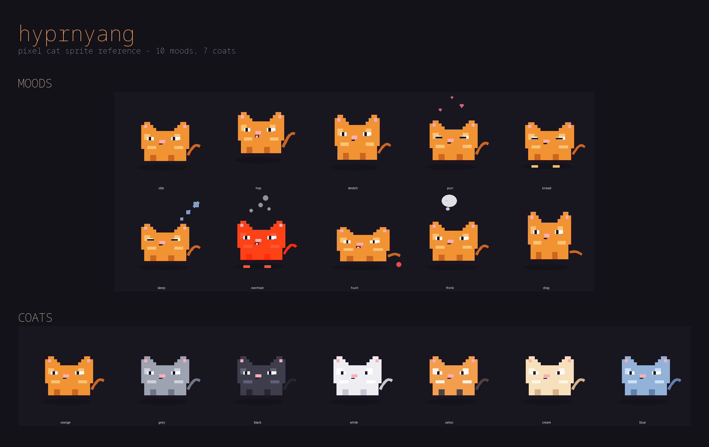

# hyprnyang

A tiny pixel-art cat that lives on your Hyprland desktop. It sits in a corner,
watches your cursor, reacts to your typing speed, naps when you go idle,
peeks out from behind fullscreen windows, and pings you with reminders,
stretch breaks, and pomodoro timers.

It's a single Python script (`hyprnyang`) plus one sound file (`meow.wav`) —
no build step, no package to install beyond a few system libraries.
 ## Preview 

 
 
## What's in this folder

```
hyprnyang     the entire program (one Python file)
meow.wav      the sound played on reminders, pets, and pomodoro events
```

That's it. There's no separate config file shipped — the script writes one
for you the first time you ask it to (see below).

## Requirements (Arch Linux)

```
sudo pacman -S gtk3 gtk-layer-shell python-gobject python-cairo libnotify
```

You'll also want one audio player already on your system for sound effects —
`paplay`, `pw-play`, or `aplay` (the script tries them in that order and
just skips sound if none are found).

Optional but recommended: add yourself to the `input` group so the cat can
read keystrokes/scrolls to react to your typing speed and trigger
scroll-hunting:

```
sudo usermod -aG input $USER
# then log out and back in
```

(This only ever *counts* key/scroll events for animation purposes — it
never logs or stores which keys you pressed.)

## Installation

1. Copy the `hyprnyang` script somewhere on your `$PATH`, e.g.:
   ```
   chmod +x hyprnyang
   cp hyprnyang ~/.local/bin/
   ```
2. Copy `meow.wav` into the config folder so the default sound works:
   ```
   mkdir -p ~/.config/hyprnyang
   cp meow.wav ~/.config/hyprnyang/
   ```
3. (Optional) Generate a default config to customize:
   ```
   hyprnyang --init
   ```
4. Autostart it with Hyprland by adding this to `~/.config/hypr/hyprland.conf`:
   ```
   exec-once = hyprnyang
   ```

## Config and state files

The script keeps everything under `~/.config/hyprnyang/` (or
`$XDG_CONFIG_HOME/hyprnyang` if you've set that):

| File          | Created by                              | Contents |
|---------------|------------------------------------------|----------|
| `config.toml` | `hyprnyang --init` (only when you run it) | All your settings, fully commented |
| `state.json`  | Automatically, the first time you drag the cat or scroll to change its coat/pattern | Just the last-used position and appearance, so it's remembered across restarts without touching `config.toml` |
| `meow.wav`    | You copy it there manually (see install steps) | The sound clip played on events |

If you never run `--init`, the cat just runs with built-in defaults — no
folder is created until you interact with it in a way that saves state.

The running cat also watches `config.toml` for changes and hot-reloads it
within about a second, so you can tweak settings live without restarting.

## Controls

- **Left-click + drag**: pick the cat up and move it anywhere on screen
- **Left double-click**: wake it up if asleep, or send it to nap immediately
- **Middle-click**: quick meow + little hop
- **Right-click**: start/stop a pomodoro focus session
- **Scroll on the cat**: cycle through coat colors
- **Shift + scroll on the cat**: cycle through coat patterns
- **Move the cursor near it**: pets it (it purrs); wave the cursor fast
  nearby and it'll pounce

## Remote control

Bind a Hyprland key to talk to the running cat:

```
hyprnyang --send "say hello"
hyprnyang --send pet
hyprnyang --send hop
hyprnyang --send stretch
hyprnyang --send sleep
hyprnyang --send wake
hyprnyang --send "coat calico"
hyprnyang --send "pattern tabby"
hyprnyang --send "pomodoro 25"
hyprnyang --send reload
hyprnyang --send quit
```

## Features at a glance

- **Cursor tracking** — eyes follow your pointer, and it'll hunt/pounce on
  fast cursor movements
- **Typing reactions** — kneads a little on-screen keyboard while you type,
  shows a live WPM meter, and "overheats" (steams) if you type too fast
- **Idle detection** — falls asleep after a period of no input
- **Fullscreen handling** — peeks from the screen edge (or hides entirely,
  if configured) when a window goes fullscreen
- **Reminders** — stretch breaks, water reminders, and custom timed
  messages (`[[reminders]]` entries in `config.toml`)
- **Pomodoro timer** — right-click to start; tracks rounds and notifies you
  via `notify-send`
- **AI agent watcher** — notices when tools like `claude`, `codex`,
  `aider`, etc. are running and reacts (mood changes + a notification when
  they finish)
- **Coats & patterns** — 7 coat colors × 6 patterns (plain, tabby, tuxedo,
  siamese, spotted, socks), changeable live by scrolling on the cat

## Command-line flags

```
hyprnyang --init            write a default config.toml and exit
hyprnyang --version         print version and exit
hyprnyang --coat <name>     override coat color for this run
hyprnyang --pattern <name>  override coat pattern for this run
hyprnyang --wpm <n>         override the overheat WPM threshold
hyprnyang --pomodoro <n>    start a focus session of n minutes on launch
hyprnyang --no-input        don't read /dev/input (disables typing reactions)
hyprnyang --send <cmd>      send a command to an already-running cat
```